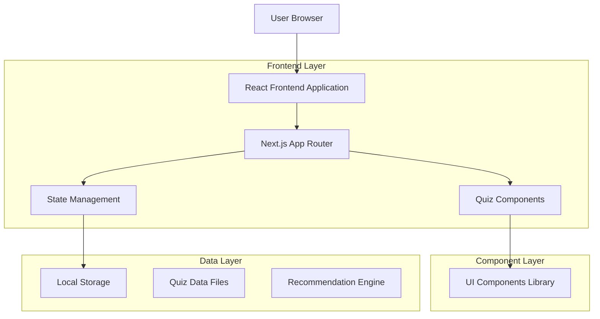
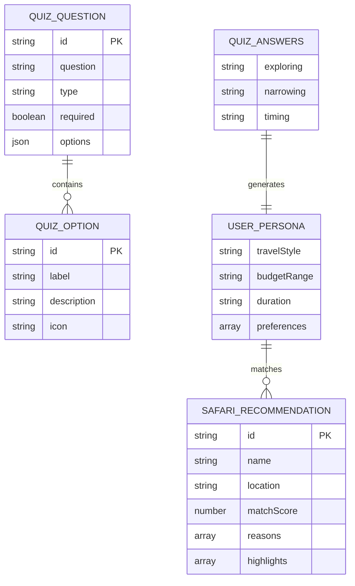
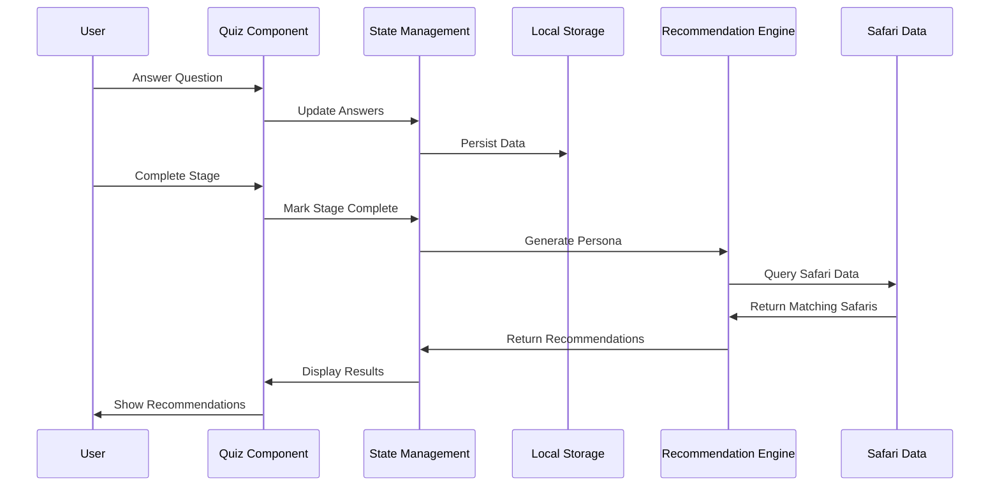

# Quiz System Technical Specifications

## Architecture Overview



## Technology Stack

- **Frontend**: React@18 + Next.js@14 + TypeScript + Tailwind CSS
- **UI Components**: Radix UI + Lucide React Icons
- **State Management**: React Context + localStorage
- **Routing**: Next.js App Router
- **Styling**: Tailwind CSS + CSS Modules

## Route Definitions

| Route | Purpose |
|-------|---------|
| /quiz | Quiz landing page with stage overview and navigation |
| /quiz/exploring | Exploring stage - travel style and preference questions |
| /quiz/narrowing | Narrowing stage - destination and activity specific questions |
| /quiz/timing | Timing stage - budget, duration, and scheduling questions |
| /quiz/results | Results page displaying personalized safari recommendations |

## Component Architecture

### Core Components Structure

```
components/
├── ui/                      # Existing UI components
│   ├── button.tsx
│   ├── card.tsx
│   ├── badge.tsx
│   ├── progress.tsx
│   └── ...
├── hamburger-menu.tsx       # Existing navigation component
└── quiz/                    # New quiz-specific components
    ├── QuestionCard.tsx     # Individual question display
    ├── ProgressBar.tsx      # Quiz progress indicator
    ├── AnswerOption.tsx     # Answer selection component
    ├── StageCard.tsx        # Stage overview cards
    └── ResultCard.tsx       # Recommendation display
```

### State Management Structure

```typescript
// Quiz Context Structure
interface QuizContextType {
  answers: QuizAnswers;
  currentStage: string;
  progress: number;
  updateAnswers: (stage: string, answers: Record<string, any>) => void;
  resetQuiz: () => void;
  getRecommendations: () => SafariRecommendation[];
}
```

## Data Models

### Core Data Structures

```typescript
// Quiz Answer Storage
export interface QuizAnswers {
  exploring: Record<string, string | string[]>;
  narrowing: Record<string, string | string[]>;
  timing: Record<string, string | string[]>;
}

// Question Definition
export interface QuizQuestion {
  id: string;
  question: string;
  type: 'single' | 'multiple' | 'range' | 'date';
  options?: QuizOption[];
  required: boolean;
  category?: string;
}

// Answer Options
export interface QuizOption {
  id: string;
  label: string;
  description?: string;
  icon?: string;
  value?: string | number;
}

// User Profile
export interface UserPersona {
  travelStyle: string;
  budgetRange: string;
  duration: string;
  preferences: string[];
  destinations: string[];
  timing: string;
}

// Recommendation Output
export interface SafariRecommendation {
  id: string;
  name: string;
  location: string;
  matchScore: number;
  reasons: string[];
  highlights: string[];
  duration: string;
  priceRange: string;
  imageUrl?: string;
  rating?: number;
}
```

### Database Schema (Entity Relationship)



## Quiz Data Structure

### Exploring Stage Questions

```typescript
// lib/quiz-data/exploring.ts
export const exploringQuestions: QuizQuestion[] = [
  {
    id: 'travel_style',
    question: 'What type of travel experience appeals to you most?',
    type: 'single',
    required: true,
    options: [
      { id: 'adventure', label: 'Adventure & Thrill', description: 'Active experiences and exciting activities' },
      { id: 'luxury', label: 'Luxury & Comfort', description: 'Premium accommodations and services' },
      { id: 'cultural', label: 'Cultural Immersion', description: 'Local traditions and authentic experiences' },
      { id: 'wildlife', label: 'Wildlife Focus', description: 'Animal viewing and conservation experiences' }
    ]
  },
  {
    id: 'group_composition',
    question: 'Who will be traveling with you?',
    type: 'single',
    required: true,
    options: [
      { id: 'solo', label: 'Solo Travel', description: 'Just me' },
      { id: 'couple', label: 'Couple', description: 'Me and my partner' },
      { id: 'family', label: 'Family', description: 'Family with children' },
      { id: 'friends', label: 'Friends', description: 'Group of friends' }
    ]
  }
];
```

### Narrowing Stage Questions

```typescript
// lib/quiz-data/narrowing.ts
export const narrowingQuestions: QuizQuestion[] = [
  {
    id: 'preferred_countries',
    question: 'Which African countries interest you most?',
    type: 'multiple',
    required: true,
    options: [
      { id: 'kenya', label: 'Kenya', description: 'Masai Mara, diverse wildlife' },
      { id: 'tanzania', label: 'Tanzania', description: 'Serengeti, Ngorongoro Crater' },
      { id: 'botswana', label: 'Botswana', description: 'Okavango Delta, pristine wilderness' },
      { id: 'south_africa', label: 'South Africa', description: 'Kruger, diverse landscapes' }
    ]
  }
];
```

### Timing Stage Questions

```typescript
// lib/quiz-data/timing.ts
export const timingQuestions: QuizQuestion[] = [
  {
    id: 'budget_range',
    question: 'What is your approximate budget per person?',
    type: 'single',
    required: true,
    options: [
      { id: 'budget', label: '$2,000 - $4,000', value: '2000-4000' },
      { id: 'mid_range', label: '$4,000 - $8,000', value: '4000-8000' },
      { id: 'luxury', label: '$8,000 - $15,000', value: '8000-15000' },
      { id: 'ultra_luxury', label: '$15,000+', value: '15000+' }
    ]
  }
];
```

## Local Storage Schema

```typescript
// Storage Configuration
const QUIZ_STORAGE_KEYS = {
  ANSWERS: 'wandar_quiz_answers',
  PROGRESS: 'wandar_quiz_progress',
  PERSONA: 'wandar_user_persona',
  RECOMMENDATIONS: 'wandar_recommendations'
};

// Storage Data Structure
interface QuizStorageData {
  answers: QuizAnswers;
  currentStage: string;
  completedStages: string[];
  startedAt: string;
  lastUpdated: string;
}
```

## Recommendation Engine

### Scoring Algorithm

```typescript
// lib/recommendation-engine.ts
export class RecommendationEngine {
  private static calculateMatchScore(
    userPersona: UserPersona,
    safari: SafariData
  ): number {
    let score = 0;
    
    // Travel style matching (30% weight)
    if (safari.style.includes(userPersona.travelStyle)) {
      score += 30;
    }
    
    // Budget compatibility (25% weight)
    if (this.isBudgetCompatible(userPersona.budgetRange, safari.priceRange)) {
      score += 25;
    }
    
    // Duration matching (20% weight)
    if (safari.duration === userPersona.duration) {
      score += 20;
    }
    
    // Preference alignment (25% weight)
    const preferenceMatch = this.calculatePreferenceMatch(
      userPersona.preferences,
      safari.features
    );
    score += preferenceMatch * 25;
    
    return Math.min(score, 100);
  }
  
  private static isBudgetCompatible(userBudget: string, safariPrice: string): boolean {
    // Implementation for budget range comparison
    return true;
  }
  
  private static calculatePreferenceMatch(userPrefs: string[], safariFeatures: string[]): number {
    const matches = userPrefs.filter(pref => safariFeatures.includes(pref));
    return matches.length / userPrefs.length;
  }
}
```

### Data Flow Architecture



## Performance Optimization

### Code Splitting Strategy
- Lazy load quiz stages to reduce initial bundle size
- Dynamic imports for recommendation engine
- Separate chunks for quiz data files

### State Optimization
- Debounced answer updates to localStorage
- Memoized recommendation calculations
- Optimized re-renders with React.memo

### Caching Strategy
- Cache quiz questions and options
- Persist user progress across sessions
- Cache recommendation results for quick navigation

## UI Design Specifications

### Design System
- **Primary Colors**: Blue (#3B82F6) and Green (#10B981)
- **Secondary Colors**: Gray (#6B7280) for text, White (#FFFFFF) for backgrounds
- **Typography**: System fonts with clear hierarchy
- **Components**: Card-based design with consistent spacing
- **Icons**: Lucide React icons for consistency

### Responsive Breakpoints
- **Mobile**: 320px - 768px
- **Tablet**: 768px - 1024px
- **Desktop**: 1024px+

### Component Styling Guidelines
- Use existing UI components from `/components/ui/`
- Maintain consistent spacing with Tailwind classes
- Implement touch-friendly interactions for mobile
- Ensure proper contrast ratios for accessibility

This technical specification provides the complete architecture and implementation details needed to build a robust, scalable quiz system that integrates seamlessly with your existing application infrastructure.